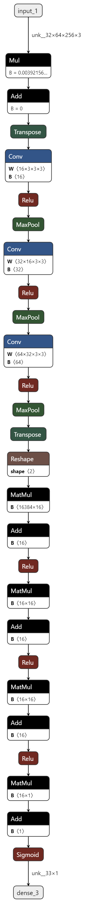
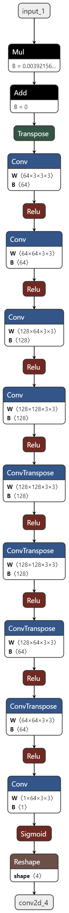

# OCR_hardsub_multivideo
----
## Instalacion
- Instalar las dependencias 
Ejectuar el siguiente comando:
``` shell
    pip install -r requirements.txt
```
- Generar el archivo credentials.json, para ello nos dirigimos a console.cloud.google.com, y realizamos el siguiente proceso.


---
## Configuracion

- .env
  en el archivo .env debera configurarse el identificador o path del ejecutable de python 
  ```python 
  PYTHONPATH = "python"     #windows 
  PYTHONPATH = "python3"    #Linux
  ```

---
## Uso
Una vez configurado solo de debera ejecutar el script para que se creen las carpetas necesarias para el proceso.
```shell
    python main.py
```
esto creara las carpetas Subtitles y Videos, el arbol de archivos quedaria asi:


## Funcionamiento
El proceso hace uso de 2 redes neuronales

### Modelo de deteccion de texto

<div align="center">
<p>hace uso de una red convolucional estandar y cuatro capas ocultas, la salida de la red esta enfocada a ser binaria 0 para no hay texto y 1 para texto <p>
  
  
</div>

### Modelo de segmentacion de texto
<p align="center">
  
</p>


